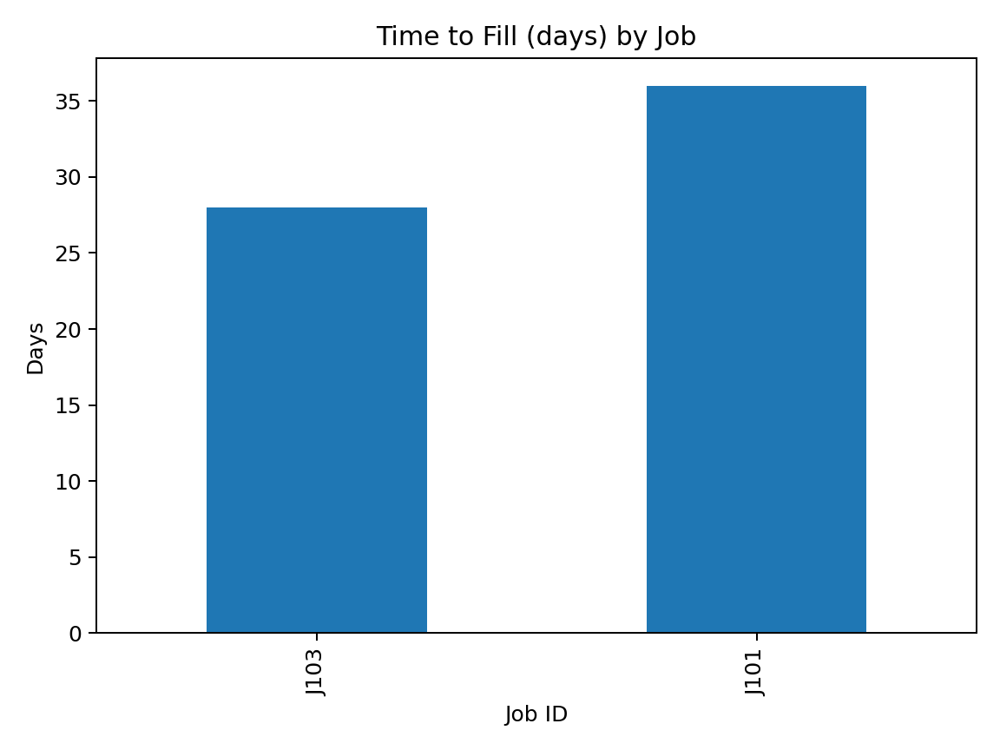
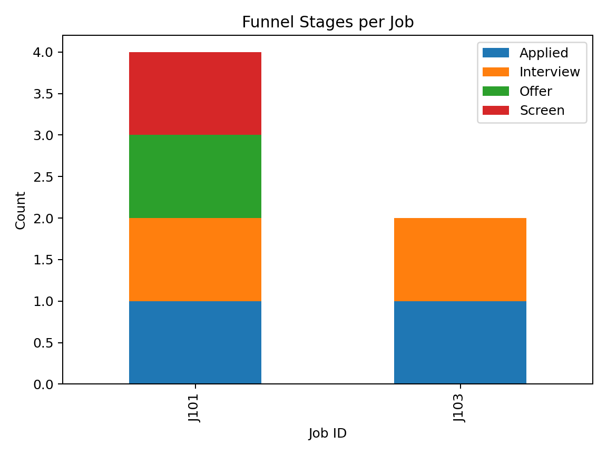

# HRIS Dashboard

This project analyzes **HR data** and generates key recruiting and payroll metrics.
It includes automated scripts, processed datasets, and visual dashboards.

## 📊 Features
- **Time-to-Fill (TTF)** → calculates how many days each closed job took to fill.
- **Recruiting Funnel** → counts candidates at each stage (Applied → Screen → Interview → Offer → Hired).
- **Payroll Mismatch** → detects Active employees who are not paid for a given month.
- **Visualizations** → bar charts for Time-to-Fill and stacked bar charts for funnel stages.

## 📂 Project Structure
HRIS-Dashboard/
├── data/
│   ├── raw/              # Input CSVs
│   └── processed/        # Outputs
├── reports/
│   └── screenshots/      # Charts
├── scripts/              # Python code
└── README.md

## 🚀 How to Run
python3 -m venv .venv
source .venv/bin/activate
pip install -r requirements.txt
python3 scripts/compute_metrics.py
python3 scripts/quick_charts.py

## 🖼️ Sample Outputs
### Time to Fill (days)

### Recruiting Funnel

## 🔧 Next Improvements
- Add **Time-to-Hire** metric
- Build an **interactive dashboard**
- Automate data refresh with scheduled jobs

